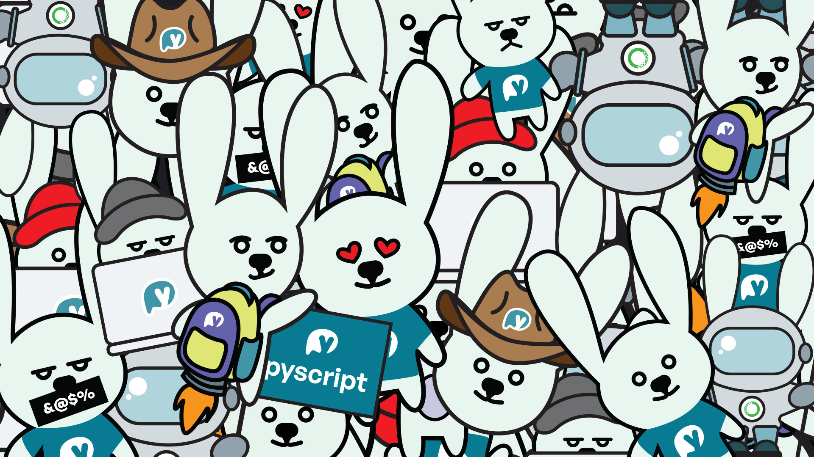
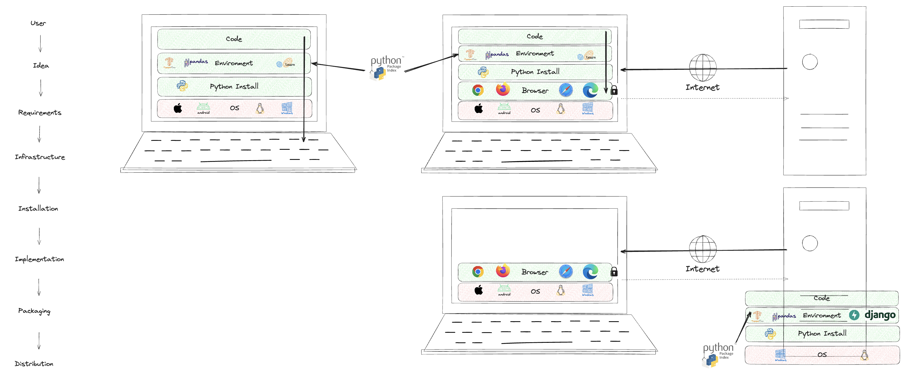
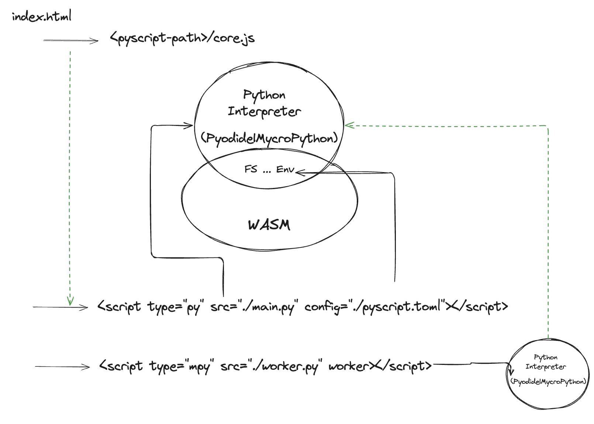
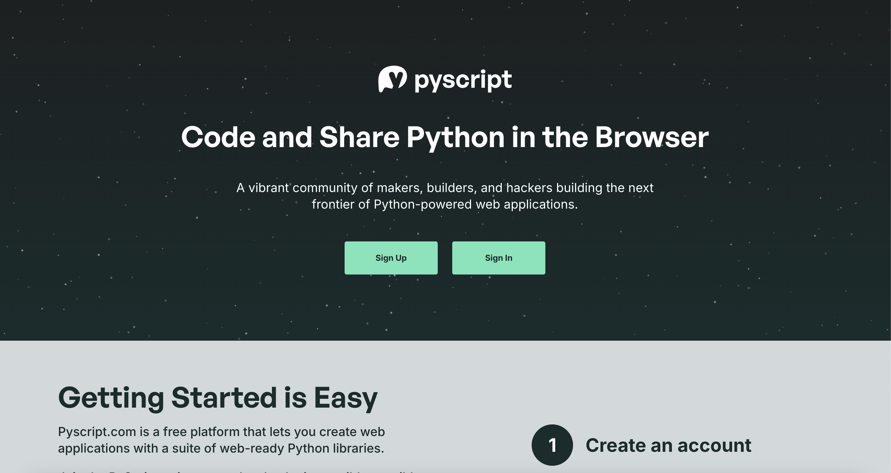

<div class="two-thirds">
    <div>
        <h2 class="presenter-title"><em style="color: #FDA703; font-style: normal; font-weight: bold;">PyCon IT 2025</h2>
          <h3 class="presenter-title" style="padding: 0; font-size: 1.4em !important;">The marvelous world of Python in Browser: a nice surprise    </h3>
          <h4 class="presenter-title" style="padding: 0; font-size: 1√em !important;">Fabio Pliger</img></h4>
          <br>
          <h6 class="presenter-title" style="padding: 0; margin-top: 0; margin-bottom: 0;">
              <i class="fa fa-envelope"></i>
              <code class="contacts">fabio@anaconda.com</code>
          </h6>
          <br>
          <h6 class="presenter-title" style="padding: 0; margin-top: 0; margin-bottom: 0;">
              <i class="fa fa-twitter"></i>
              <code class="contacts">@b_smoke</code>
      </h6>
    </div>
    <div>
        
    </div>
</div>

---


## Slides

---

<div class="one-third">
    <div class="side-title">
        <h2>About Fabio</h2>
        
    </div>
    <div style="font-size: 90%">
        <ul>
            <li> 🇧🇷 | 🇮🇹 | 🇺🇸 </li>
            <li>Creator of PyScript</li>
            <li>PSF & EuroPython Society Fellow</li>
            <li>Former Chairman of EuroPython Society</li>
            <li>Former Co-Chair of EuroPython and PyCon Italy</li>
            <li>Co-Founder of Python Italia and PyCon IT</li>
            <li>Principal Arch of AI, R&D and Tools Innovation @ Anaconda</li>
            <li>Anaconda's Ambassador of Fun & Professional Clown</li>
        </ul>
    </div>
</div>

---

<h2 style="text-transform: none;">
    <span style="color: #fda703">Hello</span>! 😍
</h2> 



---

<h2 style="text-transform: none;">
    <span style="color: #fda703">Tell me about you!</span>! 😍
</h2> 

<table id="poll-1"></table>

---

## PyCon IT is important to me...

---


---

## What is PyScript?

---

<h2>... what is <span style="color: #fda703">PyScript</span></h2>

<ul class="fragment fade-up">
    <li>
        It's a platform!
        <ul>
            <li>Platform &gt; Framework</li>
            <li>Python (Pyodide & MicroPython)</li>
            <li>+ Batteries</li>
        </ul>
    </li>
    <li class="fragment">Powerful FFI: Python <-> Javascript </li>
    <li class="fragment">
        Extensible via (JS) plugins
    </li>
    <li class="fragment">Focus on Humans </li>
    <li class="fragment">You just need a browser :) </li>
  </ul>

---

<h2> Why <span style="color: #fda703">PyScript?</span></h2>

---

<h2>... why <span style="color: #fda703">PyScript</span>?</h2>

<ul class="fragment fade-up">
    <li class="fragment">Limited support for Mobile and Web</li>
    <li class="fragment">Distributing Python is difficult</li>
    <li class="fragment">
        Simple is better than complex
        <ul class="fragment">
            <li class="fragment">Programming is complicated</li>
            <li class="fragment">Python programming is fun</li>
            <li class="fragment">Software architecture is complicated</li>
            <li class="fragment">Programming is not fun anymore :(</li>
        </ul>
    </li>
    <li class="fragment">Distributed Architectures are interesting</li>
  </ul>

---


---



---

<h2>Turns out...</h2>

<ul class="fragment fade-up" style="font-size: 26px">
    <li class="fragment">Flexibility
        <ul class="fragment">
            <li class="fragment">Runs where a browser runs</li>
            <li class="fragment">PyScript & Beeware = ❤️</li>
            <li class="fragment">MicroPython & IoT = ❤️</li>
            <li class="fragment">Wide range of applications</li>
        </ul>
    </li>
    <li class="fragment">Distributing Python is easy 🚀
        <ul class="fragment">
            <li class="fragment">Just a link</li>
            <li class="fragment">Apps as packages is kinda of cool</li>
        </ul>
    </li>
    <li class="fragment">Distributed Architectures are interesting (when possible!)
        <ul class="fragment">
            <li class="fragment">Compute --> from server to client</li>
            <li class="fragment">Reduced costs</li>
            <li class="fragment">Scalability Hack!</li>
            <li class="fragment">Additional Security: Isolation layer</li>
        </ul>
    </li>
    <li class="fragment">
        Simple is better than complex
        <ul class="fragment">
            <li class="fragment">Lots of fun!!</li>
            <li class="fragment">Shifted complexity</li>
        </ul>
    </li>
  </ul>

---

<h2><span style="color: #fda703">Challenges!</span></h2>

<ul class="fragment fade-up" style="font-size: 30px">
    <li class="fragment">Bandwidth 
        <ul class="fragment">
            <li class="fragment">MicroPython</li>
            <li class="fragment">Workers</li>
        </ul>
    </li>
    <li class="fragment">Maturity
        <ul class="fragment">
            <li class="fragment">FFI</li>
            <li class="fragment">Ecosystem is catching up fast</li>
        </ul>
    </li>
    <li class="fragment">Web problems are now your problems
        <ul class="fragment">
            <li class="fragment">well... yes :)</li>
        </ul>
    </li>
    <li class="fragment">
        Not all projects are a good fit
        <ul class="fragment">
            <li class="fragment">Know your pros/cons</li>
            <li class="fragment">Know the diffs (std python vs on web)</li>
            <li class="fragment">Persistency</li>
            <li class="fragment">Security (i.e.: secrets/pwds/etc..)</li>
        </ul>
    </li>
  </ul>

---

# Bonus Treat

# Pep 750: T-Strings! 

---

<h4><a href="https://pyscript.net" target="_blank">pyscript.net</a></h4>

<div class="stretch">
    <iframe src="https://pyscript.net" title="description" height="100%" width="100%" ></iframe>
</div>

---

<h2>How to <span style="color: #fda703">PyScript</span></h2>

It's very simple!

```html [1-2|3]
<link rel="stylesheet" href="https://pyscript.net/releases/<version>/core.css">
<script type="module" src="https://pyscript.net/releases/<version>/core.js"></script>
<script type="mpy" src="./main.py" config="./pyscript.toml" async></script>
```

---



---

<h4><a href="https://pyscript.com" target="_blank">pyscript.com</a></h4>

<a href="https://pyscript.com" target="_blank"></a>

---

# Features

---

### ~~Features~~
# Use Cases

---

<a href="https://mchilvers.pyscriptapps.com/firebase-todo/" target="_blank"> 
    <h2 style="text-transform: none;">
        Auth & Services via Firebase
    </h2> 
</a>


Thanks Martin Chilvers

---

<a href="https://fpliger.pyscriptapps.com/webllm-starter/" target="_blank"> 
    <h2 style="text-transform: none;">
        AI (WebLLM)
    </h2> 
</a>

---
<a href="https://agiammarchi.pyscriptapps.com/pep-750-tdom-component-example/" target="_blank"> 
    <h2 style="text-transform: none;">
        The future is magic: T-Strings
    </h2> 
</a>


Thanks Andrea Giammarchi!

---
<a href="https://ambv.pyscriptapps.com/streamline/" target="_blank"> 
    <h2 style="text-transform: none;">
        Gaming
    </h2> 
</a>


Thanks Łukasz Langa!

---

Bonus fun!

---

Coming Soon!

---

# Thank you!


<h2>Join the community @ pyscript.net</h2>
<h2>Try it out @ pyscript.com</h2>

---